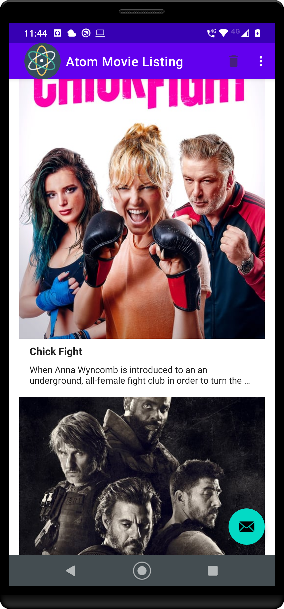

This app is presenting a list of movies taken from TMDB.
This Android app is the brother app of Atom Movie Listing iOS.

  

## How it works

We observe the stored values (movies) in the database. The repository auto-initiates if entries are old or repo is empty - it will call the network to bring fresh movies.

Requirements [here](requirements.pdf)